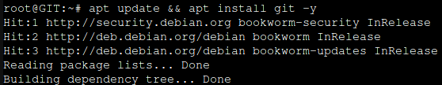

# TP - GIT
### Qu'est-ce que Git ?
Git est un système de gestion de versions décentralisé qui permet de suivre les modifications apportées à des fichiers et des projets informatiques.
#
### Sommaire :
- [*Lab0*](#Lab0)
- [*Lab1*](#Lab1)
- [*Lab2*](#Lab2)
#
## Lab0
__Mettre à jour__ les fichiers puis __installer Git__.\
Vérifier l'installation de __Git__ ainsi que sa version avec la commande _git -v_.

\
.png)

__Créer__ le répertoire **siosisr** et se déplacer dedans.

.png)\
.png)

__Renommer__ la branche principale **master** par __main__, initialiser le repository.\
(La commande _git config --global init.defaultBranch main_ permet de changer le nom de la branche par défaut ; pas besoin de retaper la commande à chaque fois car le changement est définitif.)

.png)\
.png)

__Créer__ le fichier __README.md__, __script.sh__ et __index.html__.

.png)

__Ajouter__ les fichiers dans le __staging__ avec la commande _git add ._ puis __commiter__ avec la commande _git commit -m "description du commit"_.\
Pour vérifier le __staging__, taper la commande _git status_ et pour vérifier le __commit__, taper la commande _git log_.

.png)\
.png)

__Créer__ le fichier __.gitignore__ avec la commande _touch nom_du_fichier_ (ce fichier permet d'ignorer les fichiers log) puis __créer__ ensuite le fichier __control.log__ avec cette même commande.\
Ajouter tous les fichiers au __staging__ et vérifier que le fichier __control.log__ n'est pas traqué.

.png)

__Créer la release 1.0.0__ à l'aide de tags.

.png)\
.png)
#

## Lab1
__Créer__ une branche __feature1__  dans laquelle le fichier __index.html__ sera modifié en y ajoutant un _nom_ comme _firstname_ et un _prénom_ comme _lastname_.\
__Commiter__ la modification. 

.png)\
.png)\
.png)

__Merger__ la branche __feature1__ avec la branche __main__. (la branche feature1 sera supprimée par la suite)\
Pour merger la branche feature1, __revenir__ sur la branche __main__ au préalable.\
On peut voir que des modifications ont été prises en compte.

.png)

__Créer__ une branche __fix5__  dans laquelle le fichier __script.sh__ sera modifié.\
__Commiter__ la modification.

.png)

__Revenir__ sur la branche principale (__main__) puis modifier le fichier __script.sh__ avec un contenu différent de celui de la branche __fix5__.\
__Commiter__ la modification.

.png)

__Merger__ la branche __main__ avec la branche __fix5__.\
On peut constater un confilt en rapport avec le contenu du fichier __script.sh__.

.png)

Régler le conflit, __commiter__ la modification finale et enfin __supprimer__ la branche fix5.

.png)
#
## Lab2
Dans __Github__ créer un nouveau __repository__ que l'on nommera __siosisr__.

.png)\
.png)

Sur la machine, __générer__ une clé SSH puis copier la __clé publique__ sur Github. Pour ce faire, aller dans les __settings__ puis __SSH and GPG keys__. Enfin, cliquer sur __New SSH key__ puis coller la clé publique.\
Valider.

(Pour générer une clé SSH : _ssh-keygen -t ed25519_ ; appuyer sur __Entrer__ jusqu'à ce que la clé soit générer. Pour voir la clé publique : _cat ~/.ssh/ed_ed25519.pub_ ; copier toute la clé __SAUF__ le _user@exemple_ à la fin)

.png)\
.png)\
.png)\
.png)\
.png)

Ajouter la __clé SSH__ de Github au fichier __~/.ssh/known_hosts__ sur la machine, sinon la connexion SSH échouera.

.png)

Configurer le __repository local__ pour pouvoir communiquer ensuite avec le __repository distant__.\
Vérifier à l'aide de la commande _git remote -v_.

.png)\
.png)

__Pousser__ le projet sur Github.

.png)\
.png)\
.png)\
.png)